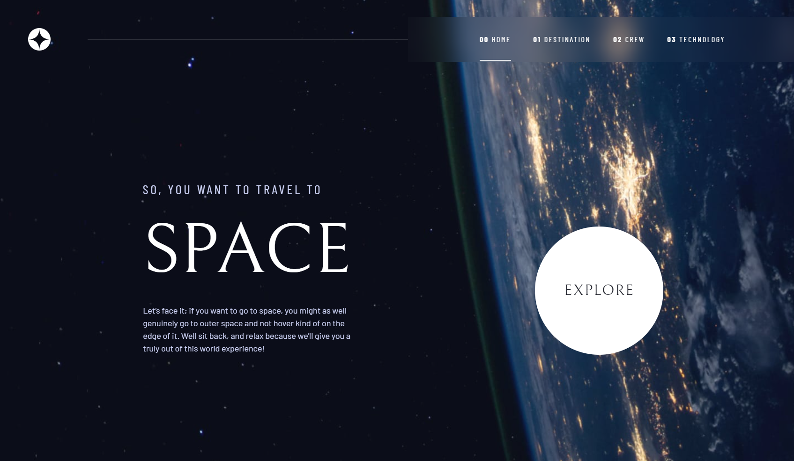
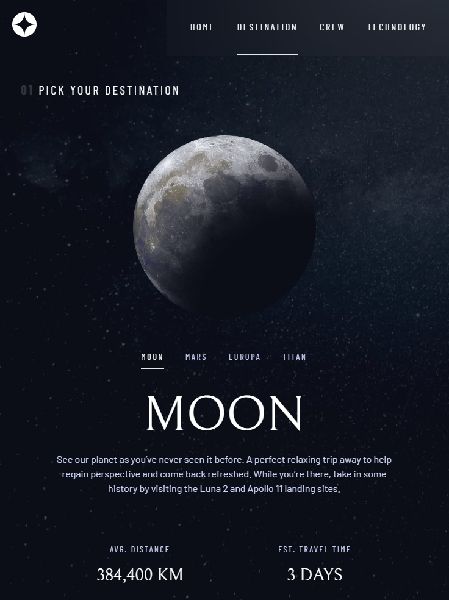
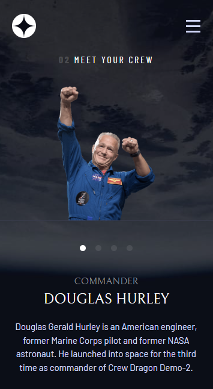

# Space Tourism Website

Welcome to the Space Tourism Website! It's meticulously designed for a seamless journey across all devices. With accessibility in mind and captivating animations, it ensures an immersive experience for all users.

Live Site: [Space Tourism Website](https://sushcod3.github.io/space-tourism/)

## Table of contents

- [Features](#features)
- [Screenshot](#screenshot)
- [Technologies Used](#technologies-used)
- [Lessons Learned](#lessons-learned)
- [Acknowledgments](#acknowledgments)

### Features

- View the optimal layout for each of the website's pages depending on their device's screen size
- See hover states for all interactive elements on the page
- View each page and be able to toggle between the tabs to see new information

### Screenshot

### Technologies Used

- Vue.js
- Tailwind CSS
- GSAP
- Vue Router

### Lessons Learned

1. **Vue Router for Seamless Navigation**: Implementing Vue Router enabled smooth transitions between pages, enhancing the user experience by allowing effortless navigation throughout the website.

2. **GSAP for Enhanced User Experience**: Utilizing GSAP (GreenSock Animation Platform) elevated the user experience through engaging animations, adding a layer of interactivity and dynamism to the interface.

3. **Accessibility for Inclusivity**: Prioritizing accessibility ensured that the website respects diversity and accommodates the preferences of all users.

4. **Effective Utilization of JavaScript Data**: Skillfully leveraging JavaScript data ensured optimal performance and seamless integration with website functionalities.

5. **Pixel-Perfect Implementation**: Meticulous alignment with design specifications, achieving pixel-perfect implementation as per the Figma design, ensured a visually cohesive and polished user interface.

### Acknowledgments

This project is a solution to the challenges provided by [Frontend Mentor](https://www.frontendmentor.io/solutions/space-tourism-website-using-vuejs-tailwind-css-gsap-and-vue-router-QE7Ddc2Y7q), with some additional features implemented by me.

